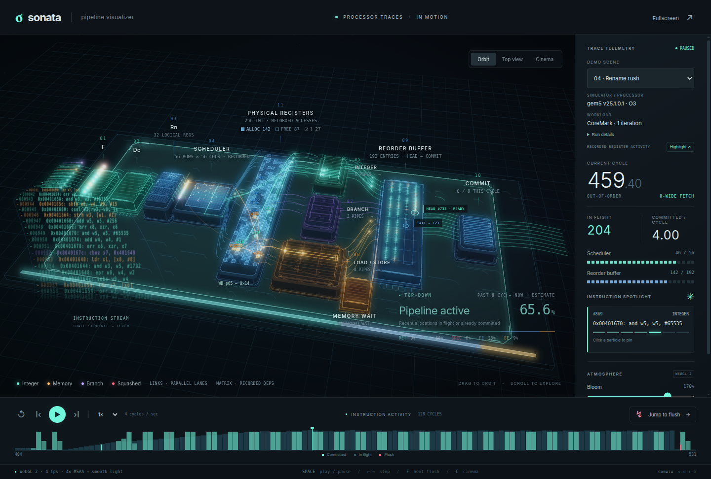

# Sonata

**[▶ ライブデモ](https://shioyadan.github.io/sonata/)**

**プロセッサの実行トレースを、動きで見る。**

Sonata（そなた）は、プロセッサ内部を流れる命令を WebGL で可視化するブラウザアプリです。命令列、依存行列、レジスタリネーム、物理レジスタ、実行パイプ、ROB、コミット、予測ミスからの復帰を、実トレースに沿って再生します。

LOAD と STORE は別のパイプで表示します。ロードは観測した最短アクセス時間に合わせた長さで通過し、遅い応答の超過分は LOAD WAIT で待機します。ストアは管路を通過したらROBで待機し、記録に再実行があればその時刻に読み出し・実行へ戻ります。コミット後の書込み状況は命令の詳細に表示します。[表示と記録の対応](docs/visualization.md)を参照してください。



## 起動

Node.js **22.23.2 以降**を使用します。推奨バージョンは `.nvmrc` に記録しています。ビルドとローカル表示には Node の標準ライブラリだけを使うので、依存パッケージのインストールは不要です。

```sh
git clone https://github.com/shioyadan/sonata.git
cd sonata
npm run build
```

生成された **`dist/sonata.html`** をブラウザで開いてください。コード・スタイル・全5デモが入った単一 HTML です。別の場所へコピーしても、ネットワーク接続なしで動きます。ブラウザは WebGL 2 が必要です。

ローカル HTTP サーバーで開く場合は `npm start` を使います。ビルド後に `http://127.0.0.1:4173` で表示できます。ソース変更後は再起動してください。

## 操作

| 操作 | 動作 |
| --- | --- |
| ドラッグ / 1本指 | カメラを回転 |
| 右ボタンドラッグ | 上へ動かすと拡大、下へ動かすと縮小 |
| ホイール / ピンチ | 拡大・縮小 |
| 2本指の平行移動 | 図を移動 |
| Fit / ダブルクリック | カメラをリセット |
| Neon / Aluminum / Paper | 発光・アルミ・紙模型の外観を切り替え |
| Space / ← → | 再生・停止 / 1サイクル移動 |
| F / C | 次のフラッシュ / Cinema |
| 命令の粒子・駒をクリック | 対象命令を追跡 |

スマートフォンでは再生・シークを画面内に保ち、**Demo & settings** からデモや表示設定を開きます。横向きにも対応しています。ページを開くと再生とアニメーションが自動で始まります。再生ボタンで一時停止し、**Motion effects** で演出を OFF にできます。

拡大は通常の Fit 表示から約10.8倍まで可能です。右ドラッグ・ホイール・ピンチ・ズームボタンで同じ上限まで近づけ、Fit で全体表示へ戻れます。

右上の Orbit / Top view / Cinema の下にある **Neon / Aluminum / Paper** ボタンで、発光する表示、アルミの表示、紙模型の表示を切り替えられます。視点ボタンと同じ見た目で1行に並び、スマートフォンでも図を見ながら操作できます。Aluminum は銀色の研磨面と幅のある反射、Paper は白い厚紙の積層・折り筋と、つやを抑えた紙面を表します。命令は Aluminum では色付き上面と銀色の縁を持つ金属パック、Paper では色紙を折った不透明な小さな折り箱です。初期表示は Neon です。[外観の仕様](docs/visual-styles.md)を参照してください。

Aluminum / Paper の命令は、待機・移動・実行を通して同じ大きさを保ちます。ユニット上では接地し、ステージ間は両端の高さを滑らかにつないで移動します。上面を上に保ったまま滑り、**Motion effects** の設定にかかわらず回転しません。命令の軌跡は、**Trails** が ON で命令を選択しているときに表示します。

## デモ

| デモ | シミュレータ / プロセッサ | 実行内容・見どころ |
| --- | --- | --- |
| Branch storm | gem5 ARM64 O3 | CoreMark、連続する予測ミス |
| Wide open | gem5 ARM64 O3 | CoreMark、高い命令流量 |
| Miss & recover | RSD / RISC-V | IntRegImm テストの起動処理、キャッシュミスと予測ミス |
| Rename rush | gem5 ARM64 O3 | CoreMark、記録されたリネームと物理レジスタの読み書き |
| x86 recovery | gem5 x86 O3 | CoreMark、micro-op とレジスタ復元 |

実行条件は各デモの **Run details** と [デモの出自](data/README.md) に記載しています。データに記録された時刻・依存関係と、推定した構造や光の演出を区別しています。Top-down はトレースから推定した分類を、現在から過去8サイクルの窓で表示します。実装上の解釈は [可視化の仕様](docs/visualization.md) を参照してください。

## 開発と検証

```sh
npm ci
npm run format:check
npm run typecheck
npm test
npm run test:server
npm run test:render
```

TypeScript はブラウザ用コード全体の型検査用、Electron はブラウザの検証用です。配布 HTML には含みません。画面のない Linux では Xvfb を使用します。

```sh
xvfb-run -a -s '-screen 0 1600x1100x24' npm run test:render
# スマートフォンの表示・タッチ操作だけを検査
xvfb-run -a -s '-screen 0 1600x1100x24' npm run test:mobile
```

検証画像は `artifacts/screenshots/` に出力します。描画検査は HTML だけを一時フォルダへコピーし、外部アクセスを禁止して実行します。CI でもモデル・単一 HTML・デスクトップ・モバイルを確認します。詳細は [開発ガイド](docs/development.md) にまとめています。

`npm run format` でソースと自作スクリプトを整形できます。README とソースコードの説明コメントは日本語で記述します。作業上の指針は [AGENTS.md](AGENTS.md)、継続して維持する判断と確認事項は [保守の資料](docs/maintenance.md) を参照してください。

## 構成

```text
src/                    編集用のソース
  sonata.cts            起動・操作・DOM 表示
  camera.cts            カメラ・投影・ポインター操作
  replay-model.cts      デモ準備・時刻に対応する再生状態
  geometry.cts          座標・経路・接地
  scene.cts             配置・固定部品・外観プリセット
  activity.cts          命令・待機列・レジスタ等の動的表示
  renderer.cts          GPU 資源・描画順
  shaders.cts           材質ごとの GLSL
  index.html            画面の骨格
  sonata.css            共通 UI・情報パネル
  scene.css             シーン上の表示
  appearance.css        画面サイズ対応・配色
data/                   Git に含める5本の実トレース抜粋と出自
scripts/                ビルド・検証・デモ抽出
vendor/konata-core/      抽出に使う Konata 解析コードの固定スナップショット
docs/                   可視化の仕様と開発手順
dist/sonata.html         配布用の生成物（Git 対象外）
artifacts/              検証画像・レポート（Git 対象外）
inputs/                 再抽出用の元ログ（Git 対象外）
work/                   ローカル作業メモ・引き継ぎ資料（Git 対象外）
```

ソースの分割と編集先は [構造の説明](docs/architecture.md) を参照してください。配布時には単一 HTML に結合します。通常のビルド・検証には Konata のチェックアウトや元ログは不要です。デモを再抽出する場合だけ、[再生成の手順](data/README.md#再生成) に沿って元ログを用意してください。

## ライセンス

Sonata 本体は [BSD-3-Clause](LICENSE.md) です。Konata から引き継いだ著作権表示を保持しています。解析コードの出典・固定リビジョンは [vendor/konata-core](vendor/konata-core/README.md) に記録しています。

同梱デモに含まれる CoreMark と RSD 由来の命令列には、それぞれのライセンスが適用されます。出典・権利表示は [第三者ライセンス](THIRD_PARTY_NOTICES.md) を参照してください。配布 HTML にも全文を含め、画面の **Licenses** から確認できます。
